<div align="center">

# ProfileForge

**Forge your GitHub profile with animated SVG widgets.**

A pixel pet that lives on your commits, and a pixel city built from them.




</div>

---

## Quick start

**The easy way: [open the configurator](https://lobsterenigma.github.io/ProfileForge/).** Pick a species, theme and season, watch the live preview, and copy the two snippets it writes for you.

Or set it up by hand. Your profile README lives in a repo named after you: `<username>/<username>`.
Pick one of two ways to set it up:

### Option A: GitHub Action (recommended, no token needed)

The Action renders your widgets inside your own repo using the built-in `GITHUB_TOKEN`, so there's no server, no rate limits and nothing to deploy.

**1.** Add `.github/workflows/profileforge.yml` to your profile repo:

```yaml
name: ProfileForge

on:
  schedule:
    - cron: "0 */6 * * *" # every 6 hours
  workflow_dispatch:

permissions:
  contents: write

jobs:
  pet:
    runs-on: ubuntu-latest
    steps:
      - uses: actions/checkout@v5
      - uses: LobsterEnigma/ProfileForge@v1
        with:
          outputs: |
            profileforge/pet.svg?name=Pinchy
            profileforge/city.svg?widget=city
```

**2.** Run it once: **Actions** tab → **ProfileForge** → **Run workflow**.

**3.** Add them to `README.md`:

```md


```

<details>
<summary>Action inputs</summary>

| Input | Default | Description |
|---|---|---|
| `outputs` | `profileforge/pet.svg` | One SVG per line, as `path?params` with the [same params](#options) as the API. |
| `github_user_name` | repo owner | Whose widgets to render. |
| `github_token` | `${{ github.token }}` | The built-in token can read public contributions. |
| `commit` | `true` | Commit and push the SVGs (only when they changed). |
| `commit_message` | `chore: feed the ProfileForge pet` | |

Step outputs: `mood`, `level`, `stage` (of the pet).
</details>

### Option B: Deploy your own API to Vercel

[](https://vercel.com/new/clone?repository-url=https%3A%2F%2Fgithub.com%2FLobsterEnigma%2FProfileForge&env=GITHUB_TOKEN&envDescription=A%20GitHub%20token%20to%20read%20public%20contribution%20data%20(no%20extra%20permissions%20needed)&envLink=https%3A%2F%2Fgithub.com%2Fsettings%2Fpersonal-access-tokens%2Fnew&project-name=profileforge&repository-name=profileforge)

The button forks this repo into your account and asks for a `GITHUB_TOKEN`. Create one [here](https://github.com/settings/personal-access-tokens/new); the default public read-only access is enough.
Then add one line to your README:

```md


```

Handy if you want to embed widgets anywhere or serve several users. See [Self-hosting](#self-hosting) for details.

## 🦀 Pixel pet

### It speaks your language

Your top language picks the species (pin one with `species=`):

| | | |
|---|---|---|
| <br>🦀 **crab** · Rust & everyone else | <br>🐹 **gopher** · Go | <br>🐍 **snake** · Python |
| <br>🐘 **elephant** · PHP | <br>🐥 **chick** · JavaScript | <br>🐢 **turtle** · TypeScript |

Each one lives somewhere that suits it (a beach, a meadow with a burrow, a jungle, the savanna, a farm, a pond) and shares the city's world: the same season, and the same weather, so a hungry pet sits in the rain and a sleeping one in the fog.

### It has moods

Your pet reacts to your recent contribution calendar:

| Mood | When | |
|---|---|---|
| **Happy** | 3+ day streak, or 15+ contributions this week |  |
| **Idle** | Contributed in the last 3 days |  |
| **Hungry** | 4–13 days without contributions: it dreams of green squares |  |
| **Sleeping** | 14+ quiet days |  |

### It evolves

XP = lifetime contributions + 2 × stars + 3 × followers, so **levels never go down**.

| Stage | Level | |
|---|---|---|
| Egg | 1–2 (cracks as it gets close) |  |
| Baby | 3–14 |  |
| Adult | 15–49 |  |
| Legendary | 50+ (gold, crown, sparkles) |  |

### It has RPG stats

- **Class**: picked from your top language. Rust → *Berserker*, Haskell → *Archmage*, CSS → *Bard*, Shell → *Necromancer*, … ([full list](src/pet/classes.ts))
- **HP**: how many of the last 14 days you contributed
- **EXP**: progress to the next level
- **STR** commits · **INT** PRs + reviews · **CHA** stars + followers · **DEX** issues (last year, log scale, 1–99)

## 🌃 Pixel city

Your last year of contributions as a skyline. Every piece of it means something:

| In the city | From your data |
|---|---|
| 🏢 One building per week | Height = that week's contributions |
| 💡 Lit windows | How many days that week you contributed |
| 🌳 A park | A week with no contributions (trees, pines, flower beds) |
| 🗼 Neon sign on the tallest tower | Your best week, lit up in your top language's color |
| 🏗️ Crane on the far right | This week, still under construction (if it's your best week yet, the crane is lifting the sign into place) |
| 🚗 Traffic | Your last 14 days; no commits means empty streets |
| 🏠 Little houses | Quiet weeks with 1–3 contributions: the suburbs |
| 🐾 Your pet on the sidewalk | Strolling when happy, dozing when you've been away |
| 🌧️ Rain, then fog | 4+ days without contributions, then 14+ (same as the pet getting hungry, then sleepy) |
| 🎆 Fireworks | A new best week, a 30+ day streak, or New Year |
| 🌠 Shooting star | A 7+ day streak |
| 🌙 The moon | Today's real moon phase |
| 🍂 The season | Cherry blossoms in spring, fireflies in summer, falling leaves in autumn, snow in winter |
| 🎃 Holidays | Pumpkins and bats for Halloween, rooftop lights for Christmas, red lanterns for Lunar New Year |

Six building styles (houses, classic, brick, glass, art-deco setbacks and spires), drifting clouds, a plane crossing the sky and birds heading home at dusk keep every skyline different, and all the randomness is seeded from your login, so no two cities look alike.

Light themes paint it at sunset, dark themes at night. Seasons follow the date, flipped with `hemisphere=south`; pass `season=` to pin one yourself:

| | |
|---|---|
| <br>`light` | <br>`dark` |
| <br>`sakura` | <br>`gameboy` |
| <br>`season=spring` | <br>`season=winter` |

## Options

| Param | Default | Description |
|---|---|---|
| `user` | *required* | GitHub login. `demo` renders sample data. |
| `widget` | `pet` | `pet` or `city`. Only needed in the Action; the API uses `/api/pet` and `/api/city`. |
| `name` | the species' | Your pet's name (max 16 chars). Defaults to Pinchy, Gogo, Monty or Ellie. |
| `species` | from your language | `crab` · `gopher` · `snake` · `elephant` · `chick` · `turtle` |
| `pet` | `true` | City only: `false` keeps your pet off the streets. |
| `theme` | `auto` | `auto` · `light` · `dark` · `dracula` · `gameboy` · `sakura` |
| `hide_border` | `false` | `true` to drop the card border. |
| `season` | from the date | Pin `spring` · `summer` · `autumn` · `winter` instead of following the date. |
| `hemisphere` | `north` | `south` flips the automatic seasons (December is summer) and mirrors the city's moon. |
| `mood`, `stage` | | Pet only, with `user=demo`, to preview any state. |

`auto` follows the viewer's light/dark setting: the beach gets stars and the city switches from sunset to night.

| | | |
|---|---|---|
| <br>`light` | <br>`dark` | <br>`dracula` |
| <br>`gameboy` | <br>`sakura` | |

## Self-hosting

Use the [Deploy with Vercel](#option-b-deploy-your-own-api-to-vercel) button, or manually:

1. Fork this repo and import it in [Vercel](https://vercel.com/new) (framework preset: *Other*, no build command).
2. Add a `GITHUB_TOKEN` environment variable ([create one](https://github.com/settings/personal-access-tokens/new), no extra permissions needed).
3. Deploy. Your pet lives at `https://<your-app>.vercel.app/api/pet?user=<login>`, and `?user=demo` works without a token.

Responses are cached for 4 hours, so your pet updates a few times a day.

## Development

```bash
npm install
npm run dev        # http://localhost:3000: gallery of every widget, mood, stage and theme
npm test
```

`GITHUB_TOKEN=... npm run dev` also lets the gallery render real users.
`npm run site` serves the configurator on http://localhost:3002; it bundles the same renderer for the browser, so its previews are the real thing.
The Action is bundled into `dist/action.js`: after changing `src/`, run `npm run build:action` and commit `dist/` (CI checks it).
`/zoom?x=4&user=demo&mood=idle` (add `&widget=city` for the city) blows a card up for pixel-level inspection.

### How it works

GitHub strips JavaScript from README images, so everything is plain SVG + CSS:

- Sprites are ASCII grids (`src/pet/species/crab.ts`), compiled to one `<path>` per color with horizontal runs merged.
- Frame animation swaps two layers with `steps(1)` opacity keyframes; movement uses nested `<g>`s so walking, jumping and breathing never fight over `transform`.
- Floating hearts and Zzz use negative `animation-delay`, so the first frame already looks alive.
- Randomness (window lights, rooftops, trees) is seeded from your login and the week's date, so the same data always renders byte-identical SVG and the Action never commits noise.
- `prefers-reduced-motion` freezes everything.

### Add a species 🦀🐹🐍🐘🐥🐢

Every pet is one file of ASCII art. Copy [`src/pet/species/crab.ts`](src/pet/species/crab.ts), redraw the grids
(body, four eye styles, three mouths, two limb frames per mood), register it in `index.ts`, and check it at `/zoom`.
Then map your language to it in `BY_LANGUAGE` and give it a home in `pet/scenery.ts`. A Java cup, a Ruby gem, a Kotlin something: all very welcome.

## Roadmap

- [x] Species picked from your top language (crab, gopher, snake, elephant, chick, turtle)
- [ ] More species: Java, Ruby, C#, Kotlin, …
- [x] GitHub Action mode (generate the SVG in your own repo, no shared rate limits)
- [x] 🌃 Pixel city: your contribution graph as a skyline
- [x] Web configurator: build your card and copy the Markdown

## License

[MIT](LICENSE)
