<div align="center">

# ProfileForge

**Forge your GitHub profile with animated SVG widgets.**

A pixel pet that lives on your commits, and a pixel city built from them.


</div>

---

## Quick start

**The easy way: [open the configurator](https://lobsterenigma.github.io/ProfileForge/).** Pick a species, theme and season, watch the live preview, and copy the two snippets it writes for you.

Or set it up by hand. Your profile README lives in a repo named after you: `<username>/<username>`.
Pick one of two ways to set it up:

### Option A: GitHub Action (recommended, no token needed)

The Action renders your widgets inside your own repo using the built-in `GITHUB_TOKEN`, so there's no server, no rate limits and nothing to deploy.

**1.** Add `.github/workflows/profileforge.yml` to your profile repo:

```yaml
name: ProfileForge

on:
  schedule:
    - cron: "0 */6 * * *" # every 6 hours
  workflow_dispatch:

permissions:
  contents: write

jobs:
  pet:
    runs-on: ubuntu-latest
    steps:
      - uses: actions/checkout@v5
      - uses: LobsterEnigma/ProfileForge@v1
        with:
          outputs: |
            profileforge/pet.svg
            profileforge/city.svg?widget=city
```

**2.** Run it once: **Actions** tab → **ProfileForge** → **Run workflow**.

**3.** Add them to `README.md`:

```md


```

**Customizing** works the same everywhere: add [options](#options) after a `?`, separated by `&`. In the Action, each line of `outputs` is one card:

```yaml
          outputs: |
            profileforge/pet.svg?name=Biscuit&species=gopher&theme=dark
            profileforge/city.svg?widget=city&season=winter&hide_border=true
```

With the [API](#option-b-deploy-your-own-api-to-vercel), the same options go into the URL: `…/api/pet?user=you&name=Biscuit&theme=dark`.

<details>
<summary>Action inputs</summary>

| Input | Default | Description |
|---|---|---|
| `outputs` | `profileforge/pet.svg` | One SVG per line, as `path?params` with the [same params](#options) as the API. |
| `github_user_name` | repo owner | Whose widgets to render. |
| `github_token` | `${{ github.token }}` | The built-in token can read public contributions. |
| `commit` | `true` | Commit and push the SVGs (only when they changed). |
| `commit_message` | `chore: feed the ProfileForge pet` | |
| `care` | `false` | `true` gives your pet a house where visitors feed, bathe and play with it. See [Let visitors care for it](#let-visitors-care-for-it). |
| `care_issue` | | The house issue's number, if you opened it yourself. Otherwise the first run opens one. |
| `care_actions` | `feed,bath,play` | What visitors may do in the house. |
| `dirt` | `true` | `false` keeps your pet clean even if nobody bathes it. Always off without `bath`. |
| `care_file` | `profileforge/care.json` | Where the care log lives. |

Step outputs: `mood`, `level`, `stage` (of the pet).
</details>

### Option B: Deploy your own API to Vercel

[](https://vercel.com/new/clone?repository-url=https%3A%2F%2Fgithub.com%2FLobsterEnigma%2FProfileForge&env=GITHUB_TOKEN&envDescription=A%20GitHub%20token%20to%20read%20public%20contribution%20data%20(no%20extra%20permissions%20needed)&envLink=https%3A%2F%2Fgithub.com%2Fsettings%2Fpersonal-access-tokens%2Fnew&project-name=profileforge&repository-name=profileforge)

The button forks this repo into your account and asks for a `GITHUB_TOKEN`. Create one [here](https://github.com/settings/personal-access-tokens/new); the default public read-only access is enough.
Then add one line to your README:

```md


```

Handy if you want to embed widgets anywhere or serve several users. See [Self-hosting](#self-hosting) for details.

## 🦀 Pixel pet

### It speaks your language

Your top language picks the species (pin one with `species=`):

| | | |
|---|---|---|
| <br>🦀 **crab** · Rust & everyone else | <br>🐹 **gopher** · Go | <br>🐍 **snake** · Python |
| <br>🐘 **elephant** · PHP | <br>🐥 **chick** · JavaScript | <br>🐢 **turtle** · TypeScript |

Each one lives somewhere that suits it (a beach, a meadow with a burrow, a jungle, the savanna, a farm, a pond) and shares the city's world: the same season, and the same weather, so a hungry pet sits in the rain and a sleeping one in the fog.

### It has moods

Your pet reacts to your recent contribution calendar:

| Mood | When | |
|---|---|---|
| **Happy** | 3+ day streak, or 15+ contributions this week |  |
| **Idle** | Contributed in the last 3 days |  |
| **Hungry** | 4–13 days without contributions: it dreams of green squares |  |
| **Sleeping** | 14+ quiet days |  |

### It evolves

XP = lifetime contributions + 2 × stars + 3 × followers, so **levels never go down**.

| Stage | Level | |
|---|---|---|
| Egg | 1–2 (cracks as it gets close) |  |
| Baby | 3–14 |  |
| Adult | 15–49 |  |
| Legendary | 50+ (gold, crown, sparkles) |  |

### It has a life of its own

- It follows **a routine that changes from day to day**: walking, sniffing around, sitting, yawning, hopping, doing laps, and the odd nap.
- It **looks around**, says the odd word (`LGTM`, `WIP`, `404`…) and performs **four tricks a day**, taking turns, from 19: dancing, twirling, a backflip, a moonwalk, juggling, blowing a kiss, spinning until it's dizzy, hiccups, a magic trick, jump rope, a selfie, hunting down a bug, holding up a commit like treasure, bubblegum, singing, heart eyes, a sneeze, sticking its tongue out, or its species' signature move (crab bubbles, gopher digging, snake hissing, elephant spraying, chick pecking, turtle zoomies). Tomorrow brings a different four.
- After **30 days without contributions it runs away**, leaving a note and a trail of footprints. Your next commit brings it home. Not your thing? Add `runaway=false`.

### Every day could be special

Like a little frog that sends postcards from its travels, your pet has days worth checking in for. At most one surprise per day, picked from the date and your contributions:

| | | |
|---|---|---|
| <br>🎄 **Christmas** | <br>🧧 **Lunar New Year** | <br>🎃 **Halloween** |
| <br>🥮 **Mid-Autumn** | <br>✉️ **A weekend trip** | <br>🎂 **Your GitHub birthday** |

- **Holidays**, each with its own outfit and decorations: New Year 🎆, Lunar New Year 🧧 (with the year's zodiac), Valentine's Day 💝, π Day 🥧 (March 14), April Fools' 🙃 (your pet shows up as another species, in a fake-nose disguise), Programmer's Day 💻 (the 256th day of the year), Mid-Autumn 🥮, Halloween 🎃 and Christmas 🎄.
- **Milestones**: your account's **GitHub birthday**, a fresh **level-up** (and hatching, growing up, turning legendary), and a **welcome back** rainbow when you return after a week or more away.
- **Weekend trips**: on a quiet weekend day your pet may be off travelling, and pins up a postcard from Localhost, The Cloud, Null Island, Stack Overflow, Port 8080 or The Kernel.
- **Rare days**: a UFO beams it up (and brings it back), a pet from another language drops by to say hi, a butterfly lands on its nose in spring, or it wears shades in summer.

Everything is decided by the date and your data, so it needs no setup, and a card rendered twice on the same day is identical. Preview any of them with `surprise=` (e.g. `/api/pet?user=demo&surprise=christmas`) or in the [configurator](https://lobsterenigma.github.io/ProfileForge/).

### As much pet as you want

Every part of the pet-keeping is optional, so it works whether you want a pretty card or a real little companion:

| You want… | Set |
|---|---|
| **Just a card to show off** | nothing: no house, no dirt, no chores. Add `runaway=false` if you'll be away for a while. |
| **Visitors can say hi, no upkeep** | `care: true` and `dirt: false`: feeding and playing, but it never gets dirty |
| **Only some visits** | `care_actions: feed,play` (any of `feed`, `bath`, `play`) |
| **The full pet** | `care: true`: visitors feed, bathe and play, and it gets smelly if nobody bathes it |

### Let visitors care for it

Turn on `care` and your pet gets a **house**: one issue in your profile repo where anyone can comment **`feed`**, **`bath`** or **`play`**. Your pet reacts with ❤️, shows the visit on its card ("Fed by …"), and gets a food bowl, a ball or soap bubbles. Skip baths for too long and it gets smudged, then smelly, then flies start circling. 🪰

Everything happens in that single issue, so your repo stays tidy: no new issues, no bot replies, just visitors' comments and reactions.

**1.** Add a comment trigger and permission to your workflow, and turn care on:

```yaml
name: ProfileForge

on:
  schedule:
    - cron: "0 */6 * * *"
  workflow_dispatch:
  issue_comment:
    types: [created]

permissions:
  contents: write
  issues: write

# One run at a time, so visits never race each other.
concurrency:
  group: profileforge
  cancel-in-progress: false

jobs:
  forge:
    # Only comments in the pet's house (never on pull requests) start a run.
    if: github.event_name != 'issue_comment' || (!github.event.issue.pull_request && startsWith(github.event.issue.title, 'ProfileForge:'))
    runs-on: ubuntu-latest
    steps:
      - uses: actions/checkout@v5
      - uses: LobsterEnigma/ProfileForge@v1
        with:
          care: true
          outputs: |
            profileforge/pet.svg
```

Want less upkeep? Add `dirt: false`, or pick what visitors may do with `care_actions: feed,play`. The house only lists what's turned on, and other commands are treated as chat.

**2.** Run it once. It opens the house, an issue titled "ProfileForge: *your pet*'s house 🏠", and prints its link. Pin it if you like.
Prefer to open the house yourself? Title it starting with `ProfileForge:` and pass its number as `care_issue`.

**3.** Link to the house under your pet:

```md
[🏠 Visit my pet's house: 🍖 feed · 🛁 bath · 🎾 play](https://github.com/you/you/issues/1)
```

<details>
<summary>How care stays safe</summary>

- **Comments are never trusted.** Only a comment's first word is read, and only to match `feed`, `bath` or `play` (and a few synonyms) exactly. It's never echoed, rendered, logged or passed to a shell. Any other comment is simply chat and is left alone.
- **The pet answers with reactions**, never with text: ❤️ done, 👀 already done today, 😕 too busy.
- **Each comment is read exactly once.** A cursor remembers the last comment read, so editing an old comment does nothing, and reactions come only after the new state is committed.
- **Limits:** each visitor can do each action once a day, there are at most 60 visits a day in total, at most 30 per run, and bots are ignored.
- **The care log (`care.json`) is validated on every read.** Unknown fields are dropped, sizes are capped, and a corrupted log simply starts over.
- **Tidy by design:** issues opened from old-style links ("ProfileForge: feed") get a one-line pointer to the house and are closed. Your own issues are never touched.
- **Least privilege:** the workflow only needs `contents: write` (to commit the SVGs) and `issues: write` (to react and open the house). Comments on pull requests never start a run, and the workflow always runs your default branch's code.

To turn it off, remove `care: true` and the `issue_comment` trigger.
</details>

### It has RPG stats

- **Class**: picked from your top language. Rust → *Berserker*, Haskell → *Archmage*, CSS → *Bard*, Shell → *Necromancer*, … ([full list](src/pet/classes.ts))
- **HP**: how many of the last 14 days you contributed
- **EXP**: progress to the next level
- **STR** commits · **INT** PRs + reviews · **CHA** stars + followers · **DEX** issues (last year, log scale, 1–99)

## 🌃 Pixel city

Your last year of contributions as a skyline. Every piece of it means something:

| In the city | From your data |
|---|---|
| 🏢 One building per week | Height = that week's contributions |
| 💡 Lit windows | How many days that week you contributed |
| 🌳 A park | A week with no contributions (trees, pines, flower beds) |
| 🗼 Neon sign on the tallest tower | Your best week, lit up in your top language's color |
| 🏗️ Crane on the far right | This week, still under construction (if it's your best week yet, the crane is lifting the sign into place) |
| 🚗 Traffic | Your last 14 days; no commits means empty streets |
| 🏠 Little houses | Quiet weeks with 1–3 contributions: the suburbs |
| 🐾 Your pet on the sidewalk | Strolling when happy, dozing when you've been away |
| 🌧️ Rain, then fog | 4+ days without contributions, then 14+ (same as the pet getting hungry, then sleepy) |
| 🎆 Fireworks | A new best week, a 30+ day streak, or New Year |
| 🌠 Shooting star | A 7+ day streak |
| 🌙 The moon | Today's real moon phase |
| 🍂 The season | Cherry blossoms in spring, fireflies in summer, falling leaves in autumn, snow in winter |
| 🎃 Holidays | Pumpkins and bats for Halloween, rooftop lights for Christmas, red lanterns for Lunar New Year |

Six building styles (houses, classic, brick, glass, art-deco setbacks and spires), drifting clouds, a plane crossing the sky and birds heading home at dusk keep every skyline different, and all the randomness is seeded from your login, so no two cities look alike.

Light themes paint it at sunset, dark themes at night. Seasons follow the date, flipped with `hemisphere=south`; pass `season=` to pin one yourself:

| | |
|---|---|
| <br>`light` | <br>`dark` |
| <br>`sakura` | <br>`gameboy` |
| <br>`season=spring` | <br>`season=winter` |

## Options

| Param | Default | Description |
|---|---|---|
| `user` | *required* | API only: whose widget to render. `demo` renders sample data. (The Action uses the repo owner.) |
| `widget` | `pet` | `pet` or `city`. Only needed in the Action; the API uses `/api/pet` and `/api/city`. |
| `name` | the species' | Your pet's name (max 16 chars). Defaults to Pinchy 🦀, Gogo 🐹, Monty 🐍, Ellie 🐘, Chirpy 🐥 or Shelly 🐢. |
| `species` | from your language | `crab` · `gopher` · `snake` · `elephant` · `chick` · `turtle` |
| `pet` | `true` | City only: `false` keeps your pet off the streets. |
| `runaway` | `true` | `false` keeps your pet home after a month without contributions (it just sleeps). |
| `theme` | `auto` | `auto` · `light` · `dark` · `dracula` · `gameboy` · `sakura` |
| `hide_border` | `false` | `true` to drop the card border. |
| `season` | from the date | Pin `spring` · `summer` · `autumn` · `winter` instead of following the date. |
| `hemisphere` | `north` | `south` flips the automatic seasons (December is summer) and mirrors the city's moon. |
| `mood`, `stage`, `trick`, `away`, `visit`, `dirt`, `surprise` | | Previews only, with `user=demo`: force a mood, stage, trick, visit, dirt level (`dirt=0…3`) or surprise (`christmas`, `postcard`, `ufo`…). To stop your real pet getting dirty, use the Action's `dirt: false` input instead. |

`auto` follows the viewer's light/dark setting: the beach gets stars and the city switches from sunset to night.

| | | |
|---|---|---|
| <br>`light` | <br>`dark` | <br>`dracula` |
| <br>`gameboy` | <br>`sakura` | |

## FAQ

<details>
<summary>I pushed a change but my profile still shows the old card</summary>

GitHub caches README images for a few minutes. Wait a bit, then hard-refresh (<kbd>Cmd</kbd>/<kbd>Ctrl</kbd> + <kbd>Shift</kbd> + <kbd>R</kbd>). Opening the SVG file in your repo always shows the latest version.
</details>

<details>
<summary>The run fails with "Permission denied" or "403" when pushing</summary>

The workflow needs `permissions: contents: write` (and `issues: write` for care). If it's there and pushes still fail, your account or organization limits the built-in token: go to your profile repo's **Settings → Actions → General → Workflow permissions** and choose **Read and write permissions**.
</details>

<details>
<summary>My contribution count is lower than on my profile</summary>

The Action's built-in token only sees public activity. To include private contributions (as counts only, nothing about the repos), turn on **Include private contributions on my profile** in your GitHub profile settings. Only public repositories count towards languages and stars.
</details>

<details>
<summary>My pet changed species, or has an unexpected name</summary>

The species follows your top language, and each species has its own default name. Pin both, e.g. `pet.svg?species=crab&name=Pinchy`.
</details>

<details>
<summary>My pet disappeared</summary>

If there's a note on a stake, it ran away after 30 days without contributions. Your next commit brings it home, or add `runaway=false` so it never leaves.

If there's a postcard instead, it's just on a weekend trip: it only travels on weekend days you haven't contributed yet, and a commit brings it straight back on the next run.
</details>

<details>
<summary>Visitors commented in the house but nothing happened</summary>

Check that the workflow has the `issue_comment` trigger, `issues: write`, and `care: true`, and that the house issue's title starts with `ProfileForge:`. Only comments whose first word is an allowed command count. Each visitor can do each action once a day (they get 👀 after that), and the card updates a few minutes later (see the first question).
</details>

## Self-hosting

Use the [Deploy with Vercel](#option-b-deploy-your-own-api-to-vercel) button, or manually:

1. Fork this repo and import it in [Vercel](https://vercel.com/new) (framework preset: *Other*, no build command).
2. Add a `GITHUB_TOKEN` environment variable ([create one](https://github.com/settings/personal-access-tokens/new), no extra permissions needed).
3. Deploy. Your pet lives at `https://<your-app>.vercel.app/api/pet?user=<login>`, and `?user=demo` works without a token.

Responses are cached for 4 hours, so your pet updates a few times a day.

## Development

```bash
npm install
npm run dev        # http://localhost:3000: gallery of every widget, mood, stage and theme
npm test
```

`GITHUB_TOKEN=... npm run dev` also lets the gallery render real users.
`npm run site` serves the configurator on http://localhost:3002; it bundles the same renderer for the browser, so its previews are the real thing.
The Action is bundled into `dist/action.js`: after changing `src/`, run `npm run build:action` and commit `dist/` (CI checks it).
`/zoom?x=4&user=demo&mood=idle` (add `&widget=city` for the city) blows a card up for pixel-level inspection.

### How it works

GitHub strips JavaScript from README images, so everything is plain SVG + CSS:

- Sprites are ASCII grids (`src/pet/species/crab.ts`), compiled to one `<path>` per color with horizontal runs merged.
- Frame animation swaps two layers with `steps(1)` opacity keyframes; movement uses nested `<g>`s so walking, jumping and breathing never fight over `transform`.
- Floating hearts and Zzz use negative `animation-delay`, so the first frame already looks alive.
- Randomness (window lights, rooftops, trees) is seeded from your login and the week's date, so the same data always renders byte-identical SVG and the Action never commits noise.
- `prefers-reduced-motion` freezes everything.

### Add a species 🦀🐹🐍🐘🐥🐢

Every pet is one file of ASCII art. Copy [`src/pet/species/crab.ts`](src/pet/species/crab.ts), redraw the grids
(body, four eye styles, three mouths, two limb frames per mood), register it in `index.ts`, and check it at `/zoom`.
Then map your language to it in `BY_LANGUAGE` and give it a home in `pet/scenery.ts`. A Java cup, a Ruby gem, a Kotlin something: all very welcome.

## Roadmap

- [x] Species picked from your top language (crab, gopher, snake, elephant, chick, turtle)
- [ ] More species: Java, Ruby, C#, Kotlin, …
- [x] GitHub Action mode (generate the SVG in your own repo, no shared rate limits)
- [x] 🌃 Pixel city: your contribution graph as a skyline
- [x] Web configurator: build your card and copy the Markdown
- [x] Visitors can feed, bathe and play with your pet
- [ ] Talk to your pet (AI, opt-in, with strict limits)

## License

[MIT](LICENSE)
