<div align="center">

# ProfileForge

**Forge your GitHub profile with animated SVG widgets.**

A pixel pet that lives on your commits: it bounces when you ship, gets hungry when you don't,
and evolves as your lifetime contributions grow.


</div>

---

## Quick start

Your profile README lives in a repo named after you: `<username>/<username>`.
Pick one of two ways to feed your pet:

### Option A: GitHub Action (recommended, no token needed)

The Action renders your pet inside your own repo using the built-in `GITHUB_TOKEN`, so there's no server, no rate limits and nothing to deploy.

**1.** Add `.github/workflows/profileforge.yml` to your profile repo:

```yaml
name: ProfileForge

on:
  schedule:
    - cron: "0 */6 * * *" # every 6 hours
  workflow_dispatch:

permissions:
  contents: write

jobs:
  pet:
    runs-on: ubuntu-latest
    steps:
      - uses: actions/checkout@v5
      - uses: LobsterEnigma/ProfileForge@v1
        with:
          outputs: |
            profileforge/pet.svg?name=Pinchy
```

**2.** Run it once: **Actions** tab → **ProfileForge** → **Run workflow**.

**3.** Add your pet to `README.md`:

```md

```

<details>
<summary>Action inputs</summary>

| Input | Default | Description |
|---|---|---|
| `outputs` | `profileforge/pet.svg` | One SVG per line, as `path?params` with the [same params](#options) as the API. |
| `github_user_name` | repo owner | Whose pet to render. |
| `github_token` | `${{ github.token }}` | The built-in token can read public contributions. |
| `commit` | `true` | Commit and push the SVGs (only when they changed). |
| `commit_message` | `chore: feed the ProfileForge pet` | |

Step outputs: `mood`, `level`, `stage`.
</details>

### Option B: Deploy your own API to Vercel

[](https://vercel.com/new/clone?repository-url=https%3A%2F%2Fgithub.com%2FLobsterEnigma%2FProfileForge&env=GITHUB_TOKEN&envDescription=A%20GitHub%20token%20to%20read%20public%20contribution%20data%20(no%20extra%20permissions%20needed)&envLink=https%3A%2F%2Fgithub.com%2Fsettings%2Fpersonal-access-tokens%2Fnew&project-name=profileforge&repository-name=profileforge)

The button forks this repo into your account and asks for a `GITHUB_TOKEN`. Create one [here](https://github.com/settings/personal-access-tokens/new); the default public read-only access is enough.
Then add one line to your README:

```md

```

Handy if you want to embed pets anywhere or serve several users. See [Self-hosting](#self-hosting) for details.

## It has moods

Your pet reacts to your recent contribution calendar:

| Mood | When | |
|---|---|---|
| **Happy** | 3+ day streak, or 15+ contributions this week |  |
| **Idle** | Contributed in the last 3 days |  |
| **Hungry** | 4–13 days without contributions: it dreams of green squares |  |
| **Sleeping** | 14+ quiet days |  |

## It evolves

XP = lifetime contributions + 2 × stars + 3 × followers, so **levels never go down**.

| Stage | Level | |
|---|---|---|
| Egg | 1–2 (cracks as it gets close) |  |
| Baby | 3–14 |  |
| Adult | 15–49 |  |
| Legendary | 50+ (gold, crown, sparkles) |  |

## It has RPG stats

- **Class**: picked from your top language. Rust → *Berserker*, Haskell → *Archmage*, CSS → *Bard*, Shell → *Necromancer*, … ([full list](src/pet/classes.ts))
- **HP**: how many of the last 14 days you contributed
- **EXP**: progress to the next level
- **STR** commits · **INT** PRs + reviews · **CHA** stars + followers · **DEX** issues (last year, log scale, 1–99)

## Options

| Param | Default | Description |
|---|---|---|
| `user` | *required* | GitHub login. `demo` renders a sample pet. |
| `name` | `Pinchy` | Your pet's name (max 16 chars). |
| `theme` | `auto` | `auto` · `light` · `dark` · `dracula` · `gameboy` · `sakura` |
| `hide_border` | `false` | `true` to drop the card border. |
| `mood`, `stage` | | Only with `user=demo`, to preview any state. |

`auto` follows the viewer's light/dark setting. At night, the beach gets stars.

| | | |
|---|---|---|
| <br>`light` | <br>`dark` | <br>`dracula` |
| <br>`gameboy` | <br>`sakura` | |

## Self-hosting

Use the [Deploy with Vercel](#option-b-deploy-your-own-api-to-vercel) button, or manually:

1. Fork this repo and import it in [Vercel](https://vercel.com/new) (framework preset: *Other*, no build command).
2. Add a `GITHUB_TOKEN` environment variable ([create one](https://github.com/settings/personal-access-tokens/new), no extra permissions needed).
3. Deploy. Your pet lives at `https://<your-app>.vercel.app/api/pet?user=<login>`, and `?user=demo` works without a token.

Responses are cached for 4 hours, so your pet updates a few times a day.

## Development

```bash
npm install
npm run dev        # http://localhost:3000: gallery of every mood × stage × theme
npm test
```

`GITHUB_TOKEN=... npm run dev` also lets the gallery render real users.
The Action is bundled into `dist/action.js`: after changing `src/`, run `npm run build:action` and commit `dist/` (CI checks it).
`/zoom?x=4&user=demo&mood=idle` blows a card up for pixel-level inspection.

### How it works

GitHub strips JavaScript from README images, so everything is plain SVG + CSS:

- Sprites are ASCII grids (`src/pet/species/crab.ts`), compiled to one `<path>` per color with horizontal runs merged.
- Frame animation swaps two layers with `steps(1)` opacity keyframes; movement uses nested `<g>`s so walking, jumping and breathing never fight over `transform`.
- Floating hearts and Zzz use negative `animation-delay`, so the first frame already looks alive.
- `prefers-reduced-motion` freezes everything.

### Add a species 🦀🐹🐍

Every pet is one file of ASCII art. Copy [`src/pet/species/crab.ts`](src/pet/species/crab.ts), redraw the grids
(body, four eye styles, three mouths, two limb frames per mood), register it in `index.ts`, and check it at `/zoom`.
A Go gopher, a Python snake, a PHP elephant: all very welcome.

## Roadmap

- [ ] More species, picked from your top language
- [x] GitHub Action mode (generate the SVG in your own repo, no shared rate limits)
- [ ] 🌃 Pixel city: your contribution graph as a skyline at night
- [ ] Web configurator: build your card and copy the Markdown

## License

[MIT](LICENSE)
